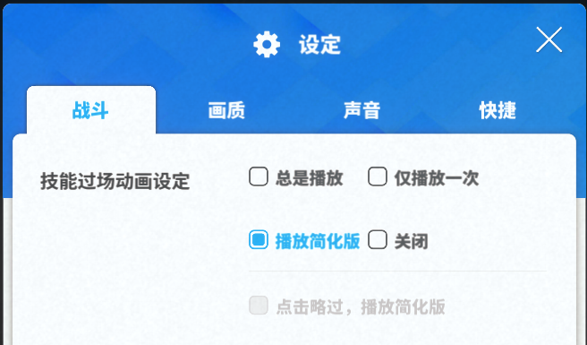
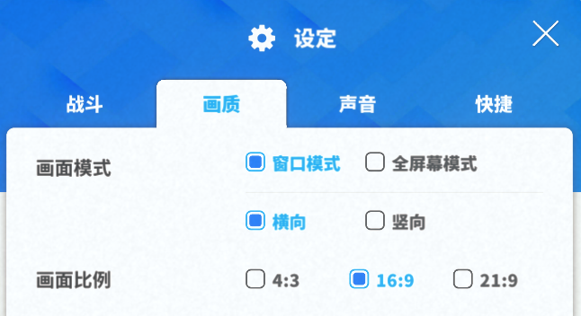
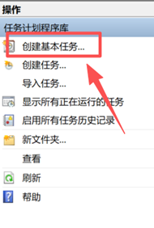
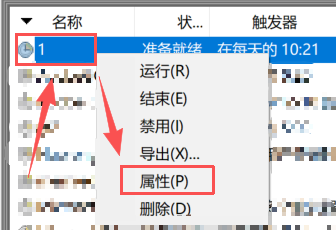
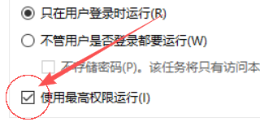
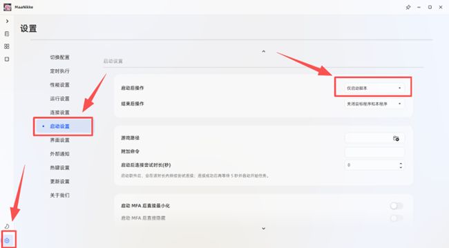

# MaaNikke - NIKKE 自动化每日任务工具

基于 [MaaFramework](https://github.com/MaaXYZ/MaaFramework) 的《胜利女神：NIKKE》自动化工具，旨在免去每日任务的重复操作。

## 声明

- 本项目仅供**学习与技术交流**使用，禁止用于任何商业用途。
- 本项目与《胜利女神：NIKKE》及其开发商、发行商无任何关联，未获得官方授权或许可。
- 游戏内素材（图像、文字、商标等）的版权归原权利方所有，如涉及侵权请联系删除。
- 使用本工具产生的一切后果（包括但不限于账号异常、封禁）由使用者自行承担。
- 下载或使用本项目即视为同意以上条款。

## 功能列表

- 启动游戏
- 领取登录奖励
- 邮件领取
- 每日 / 每周奖励领取
- PASS 奖励领取
- 付费商店领取
- 道具商店每日购买
- 前哨防御
- 派遣公告栏
- 咨询和送礼
- 装备升级
- 好友点数收取赠送
- 社交点招募
- 模拟室
- 竞技场
- 拦截战
- 爬塔
- 同步器和循环室
- 协同作战
- 联盟突袭（beta）
- 更生馆
- 大型活动：不定时随版本更新（如果有空的话）

## 使用注意事项

> ⚠️ **重要提示**
> 本自动化程序未考虑到过于复杂的场景，仅能满足**绝大部分养老号**的需求。
> 如果你仍处于**开荒阶段**、功能未解锁或关卡打不过，建议暂时**不要使用**。
> 本程序旨在**免去每日任务的重复操作**，若希望培养顶级战力号，还请多上线微操 😉

### 游戏内设置（务必完成）

1. 过场动画需改为简化版或者关闭。

2. 画质修改如下，**务必！！！**

3. 动态壁纸播放建议关闭，防止莫名其妙的 bug 出现。

4. 在使用 MaaNikke 前，先手动完成过一次每日。

5. **务必战斗模式默认开启自动。**

### 环境要求

- **必须安装 Python（3.10 及以上），安装时务必勾选 "Add Python to PATH"**，否则 agent 无法启动。
  Python 3.13.13 下载地址：<https://www.python.org/ftp/python/3.13.13/python-3.13.13-amd64.exe>
- 首次启动 agent 时会自动安装 `maafw==5.10.2` 和 `Pillow`（需要联网；网络不佳会自动切换清华镜像源；若已安装其他 5.x 版本 maafw 会直接复用，不重复安装）。
- `MaaNikke.exe` 需右键以**管理员身份**运行。
- NIKKE 必须由 **WeGame** 启动（GUI 内的"启动游戏"选项无效）。

### 更新方式

版本更新时替换 `agent`、`interface.json`、`resource` 这三个文件（建议先删除原文件再复制）。

## 使用方法

本程序提供两种方案，请根据需求选择。

### 方案 A：手动版

1. 自行打开 **WeGame**，启动 **Nikke** 并进入游戏大厅。
2. 右键以**管理员身份**运行 `MaaNikke.exe`。
3. 去吃早/晚餐，回来后任务即自动完成。

---

### 方案 B：全程自动化

#### 1. 安装依赖

- 下载并安装 **[AutoHotkey 2.0](https://www.autohotkey.com/)**。

#### 2. 启动方式（二选一）

- **方式一：手动直接运行批处理**
  右键以**管理员身份**运行 `autoMaaNikke.bat`。

- **方式二：定时自动化（通过 Windows 任务计划程序定时启动）**

  1. 打开 **任务计划程序**（开始 → Windows 管理工具 → 任务计划程序）。

     

  2. 点击 **创建基本任务**。

  3. 填写名称 → 下一步。

  4. 勾选 **每天** → 下一步。

  5. 设定希望运行的时间 → 下一步。

  6. 选择 **启动程序** → 下一步。

  7. 点击 **浏览**，选择下载解压后文件夹内的 `autoMaaNikke.bat` → 下一步 → 完成。

  8. 右键刚刚创建的任务，选择 **属性**。

     

  9. 勾选 **最高权限运行**。

     

#### 3. 配置 MaaNikke

打开 `MaaNikke.exe`，进入 **设置 → 启动设置 → 启动后操作**，勾选 **仅启动脚本**

> （因为 Nikke 必须由 WeGame 启动，此处选择"启动游戏"无效）
>
> 

#### 4. 可选设置（更省心）

在 **设置 → 启动设置** 中，将 **结束后操作** 设为 **关闭目标程序和本程序**，实现全自动关闭。

---

### 最终效果

只需保持电脑开机，到设定时间后，程序将自动完成每日任务。
**真正的解放自己，享受人生吧！🎉**

## 致谢

衷心感谢以下开源项目的大力支持：

- [MFAAvalonia](https://github.com/MaaXYZ/MFAAvalonia)
- [MaaFramework](https://github.com/MaaXYZ/MaaFramework)
- [MaaPipelineEditor](https://github.com/kqcoxn/MaaPipelineEditor)

感谢各位开发者的无私贡献，让我的工作得以顺利进行。

## 开源许可证

本项目基于 [GPL-3.0](LICENSE) 开源。
